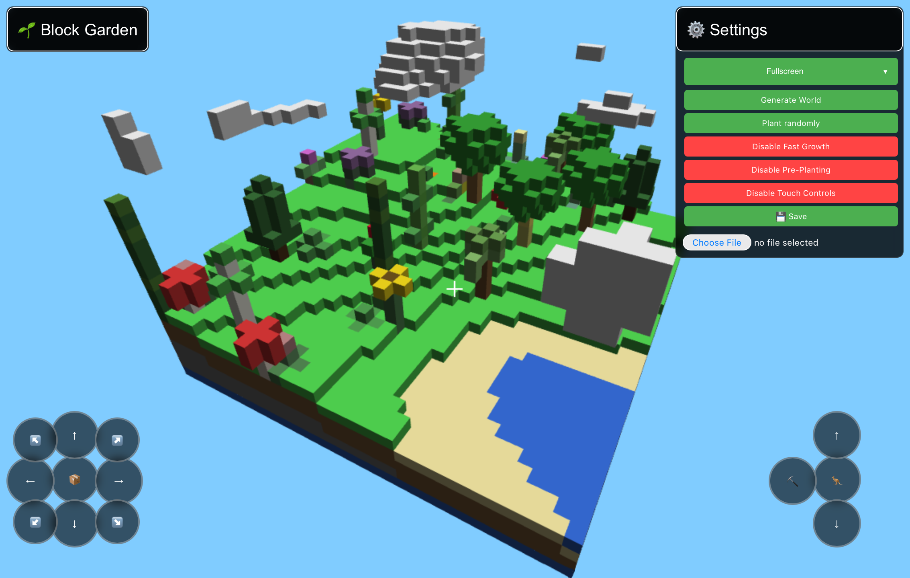
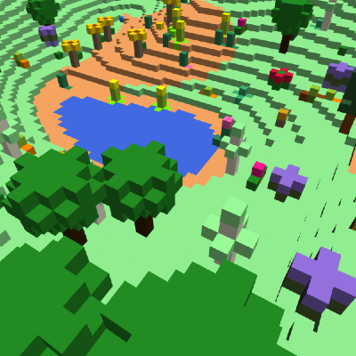
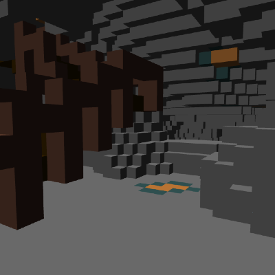
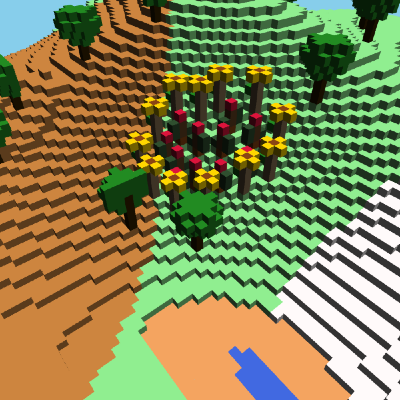
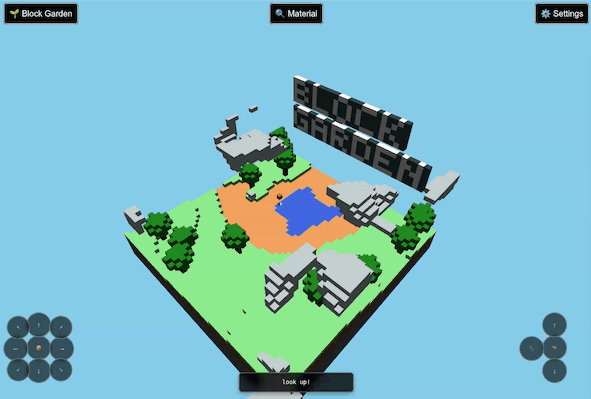

# [Block Garden](https://kherrick.github.io/block-garden/)

[](https://deepwiki.com/kherrick/block-garden)

Block Garden - A 3D sandbox exploration and farming game. Explore procedurally generated worlds, dig for resources, and cultivate a variety of plants.

[](https://kherrick.github.io/block-garden/)

## To play locally

```sh
npm i && npm start
```

## 🧩 Features include:

- Procedural World Generation - Each world is unique, generated from a shareable seed
- Building - Use collected materials to place blocks and shape the world
- Clouds - Continue building and farming while in the sky
- Planting System - Plant different seed types with realistic growth cycles
- Resource Management - Dig for resources like stone, dirt, and sand.
- Save & Load - Your progress can be saved on device or as a file to share
- Privacy-respecting (no login or data collection)
- Installation and offline play supported
- Cross-platform (desktop & mobile)

## 🎮 Quick Start

- **Movement:** `w` / `a` / `s` / `d`
- **Inventory:** `e`
- **Camera:** `Arrow Keys`
- **Change Block:** `~` / `` ` ``
- **Jump / Ascend:** `Space`
- **Descend:** `Shift`
- **Place / Remove Block:** `Enter`
- Click Game Canvas To Lock Mouse
  - **Use crosshair to center block placement**
  - **Left Click:** Place Block
  - **Right Click:** Remove Block

### Included Game Saves

Get started by clicking one of the saved games below:

### [The Garden](https://kherrick.github.io/block-garden/?gameSave=https://kherrick.github.io/block-garden/assets/game-saves/The-Garden.pdf)

[](https://kherrick.github.io/block-garden/?gameSave=https://kherrick.github.io/block-garden/assets/game-saves/The-Garden.pdf)

### [Caves](https://kherrick.github.io/block-garden/?gameSave=https://kherrick.github.io/block-garden/assets/game-saves/Caves.pdf)

[](https://kherrick.github.io/block-garden/?gameSave=https://kherrick.github.io/block-garden/assets/game-saves/Caves.pdf)

### [Flowers](https://kherrick.github.io/block-garden/?gameSave=https://kherrick.github.io/block-garden/assets/game-saves/Flowers.pdf)

[](https://kherrick.github.io/block-garden/?gameSave=https://kherrick.github.io/block-garden/assets/game-saves/Flowers.pdf)

### [Gateway To The Clouds](https://kherrick.github.io/block-garden/?gameSave=https://kherrick.github.io/block-garden/assets/game-saves/Gateway-To-The-Clouds.pdf)

[](https://kherrick.github.io/block-garden/?gameSave=https://kherrick.github.io/block-garden/assets/game-saves/Gateway-To-The-Clouds.pdf)

## Demos

### Fireworks

[](https://www.youtube.com/watch?v=1aW5C7A9wSk)

### Random Planting

[](https://www.youtube.com/watch?v=eRDM5INHyKA)

### Gateway To The Clouds

[](https://www.youtube.com/watch?v=OIdKx0u8REA)
